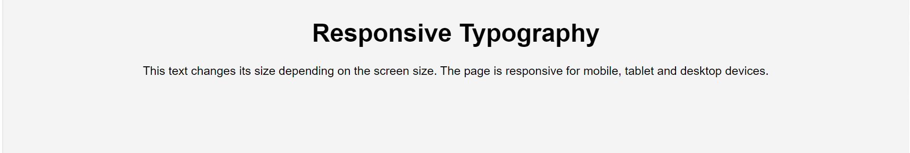
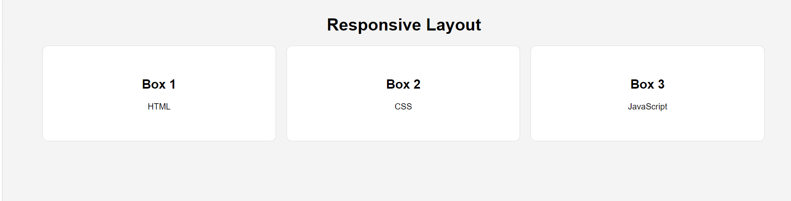
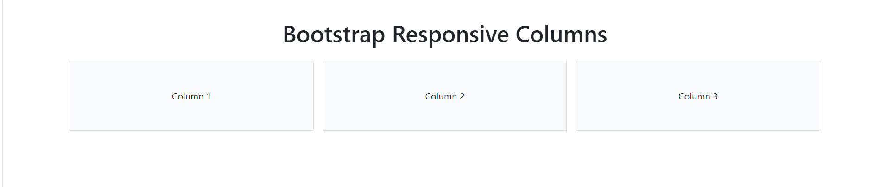
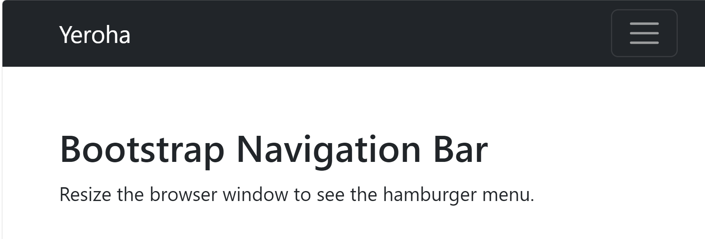
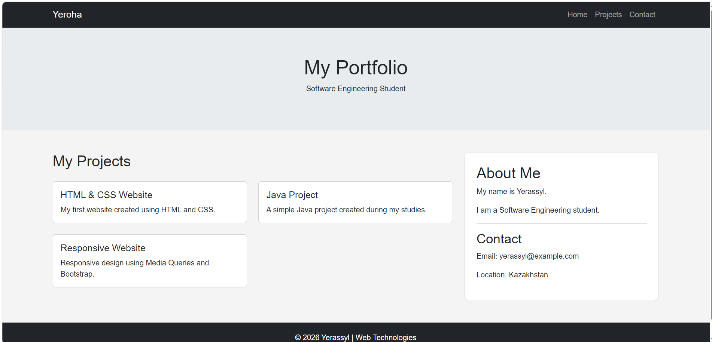

# Assignment 3 - Responsive Web Design

## Student Information

**Name:** Nassypkeliyev Yerassyl  
**Group:** SE-2538

---

## Task 0 - Responsive Typography

In this task, I created responsive text using CSS Media Queries.
The font size changes depending on the screen size.

---

## Task 1 - Responsive Layout with Media Queries

I created three responsive boxes using CSS Flexbox and Media Queries.

On desktop, three boxes are displayed in one row.
On tablet, two boxes are displayed in the first row.
On mobile, the boxes are stacked vertically.

---

## Task 2 - Bootstrap Responsive Columns

I used the Bootstrap 12-column grid system.

I used:

`col-12 col-md-6 col-lg-4`

This makes the columns responsive on mobile, tablet and desktop devices.

---

## Task 3 - Bootstrap Navigation Bar

I created a responsive Bootstrap navigation bar.

The navbar contains a logo and navigation links.
On smaller screens, the navigation links collapse into a hamburger menu.

---

## Task 4 - Responsive Portfolio Page

For the final task, I created a responsive portfolio website using both Bootstrap and CSS Media Queries.

The page contains:

- Responsive Bootstrap navbar
- Portfolio header
- Project cards
- Bootstrap grid
- Personal information sidebar
- Contact information
- Responsive footer
- Custom Media Queries

---

## Summary

In this assignment, I learned how to create responsive web pages for different screen sizes.

I practiced CSS Media Queries and the Bootstrap Grid system. I also learned how Bootstrap columns and responsive navigation bars work.

The final portfolio combines Bootstrap components with custom CSS to create a responsive layout for mobile, tablet and desktop devices.